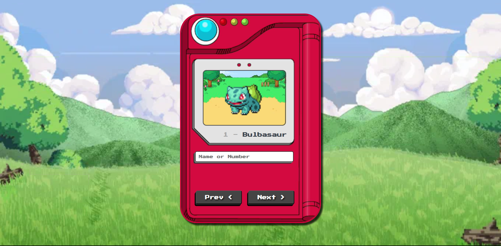

# Pokedex

Deploy: (EM BREVE)

## Sobre

É um banco de dados contendo vários tipos de Pokemon.

### Objetivo

Desenvolver minhas habilidades de Javascript.

### Desafio

Desenvolver meus conhecimentos de algoritmos do JS e também de como funciona a utilização de API´s.

### Conclusão

(EM BREVE)

### Ferramentas Utilizadas

- HTML
- CSS
- JavaScript